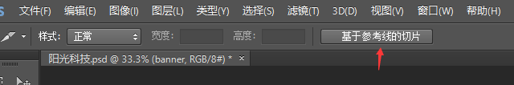

# Photoshop图像处理专家
> PS 工具是我们使用频率比较高的软件之一，我们学习PS目的不是为了设计海报做电商和UI的，而是要求：
    1. 会简单的抠图
    1. 会简单的修改PSD效果图
    1. 熟练的切图
    1. 能和网站美工美眉有共同话题。。。。。
***
## 常见的图片格式
1. jpg图像格式： 
    > JPEG（.JPG）对色彩的信息保留较好，高清，颜色较多，我们产品类的图片经常用jpg格式的
2. gif图像格式：
    > GIF格式最多只能储存256色，所以通常用来显示简单图形及字体，但是可以保存透明背景和动画效果
3. png图像格式
    > 是一种新兴的网络图形格式，结合了GIF和JPEG的优点，具有存储形式丰富的特点，能够保持透明背景
4. PSD图像格式
    > PSD格式是Photoshop的专用格式，里面可以存放图层、通道、遮罩等多种设计草稿。Photoshop 打开这种格式的文件，会显示独特的图层，其他格式是没有的。
## ps切片

ps切图片，分两大步：
1. 用切片选中图片
    * 利用切片工具手动划出
    * 图层菜单---**新建基于图层的切片**
    * 利用辅助线 来切图 --    基于参考线的切片 
    
1. 导出切片
    - 文件菜单   -- 存储为web设备所用格式 ----   选择  我们要的图片格式 ----  点存储  ---   别忘了选中的切片(默认是所有的切片)

## 辅助线和切片使用及清除

视图菜单-- 清除 辅助线/ 清除切片

## 切图插件
Cutterman是一款运行在photoshop中的插件，能够自动将你需要的图层进行输出， 以替代传统的手工 "导出web所用格式" 以及使用切片工具进行挨个切图的繁琐流程。 它支持各种各样的图片尺寸、格式、形态输出，方便你在pc、ios、Android等端上使用。 它不需要你记住一堆的语法、规则，纯点击操作，方便、快捷，易于上手。

官网: http://www.cutterman.cn/zh/cutterman

注意： cutterman插件要求你的ps 必须是完整版，不能是绿色版，所以大家需要从新安装完整版本。 检测能否安装插件，就是在 窗口>扩展功能 能否使用，如果能选中使用的话，就是可以安装插件的，否则就是绿色版本，不能安装，需要完整安装后才能使用。

傻瓜式安装。双击安装。需要注册账号，但是是免费的。
窗口>扩展功能  打开这个插件。

