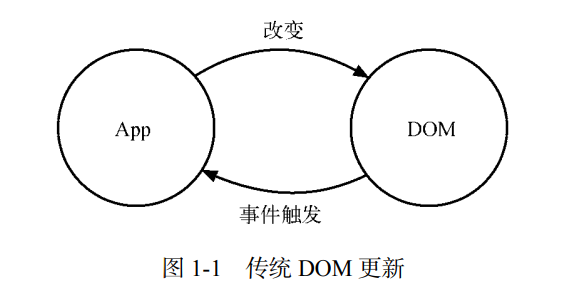
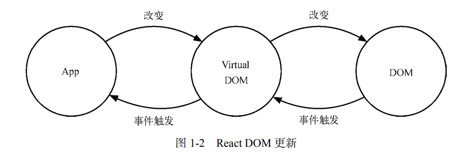

## 1. 第1章初入 React 世界
&emsp;&emsp;欢迎进入 React 世界。从本章开始，不论你是刚刚入门的前端开发者，还是经验老道的资深工程师，都可以学习到 React 的基本思想以及基本用法。在之后慢慢深入的过程中，各节均会不同程度地带上进阶的实践与分析。希望在本章结束时，我们能够带领你实现应用 React 进行基本的组件开发。请从这里开始你的旅程……
### 1. React 简介
&emsp;&emsp;React 是 Facebook 在 2013 年开源在 GitHub 上的 JavaScript 库。React 把用户界面抽象成一个个组件，如按钮组件 Button、对话框组件 Dialog、日期组件 Calendar。开发者通过组合这些组件，最终得到功能丰富、可交互的页面。通过引入 JSX 语法，复用组件变得非常容易，同时也能保证组件结构清晰。有了组件这层抽象，React 把代码和真实渲染目标隔离开来，除了可以在浏览器端渲染到 DOM 来开发网页外，还能用于开发原生移动应用。

  1. 专注视图层

  &emsp;&emsp;现在的应用已经变得前所未有的复杂，因而开发工具也必须变得越来越强大。和 Angular、Ember 等框架不同，React 并不是完整的 MVC/MVVM 框架，它专注于提供清晰、简洁的 View（视图）层解决方案。而又与模板引擎不同，React 不仅专注于解决 View 层的问题，又是一个包括 View 和 Controller 的库。对于复杂的应用，可以根据应用场景自行选择业务层框架，并根据需要搭配 Flux、Redux、GraphQL/Relay 来使用。React 不像其他框架那样提供了许多复杂的概念与烦琐的 API，它以 Minimal API Interface 为目标，只提供组件化相关的非常少量的 API。同时为了保持灵活性，它没有自创一套规则，而是尽可能地让用户使用原生 JavaScript 进行开发。只要熟悉原生 JavaScript 并了解重要概念后，就可以很容易上手 React 应用开发。
  
  1. Virtual DOM 

  &emsp;&emsp;真实页面对应一个 DOM 树。在传统页面的开发模式中，每次需要更新页面时，都要手动操作 DOM 来进行更新，如图 1-1 所示。

  

  &emsp;&emsp;DOM 操作非常昂贵。我们都知道在前端开发中，性能消耗最大的就是 DOM 操作，而且这部分代码会让整体项目的代码变得难以维护。React 把真实 DOM 树转换成 JavaScript 对象树，也就是 Virtual DOM，如图 1-2 所示。

  

  &emsp;&emsp;每次数据更新后，重新计算 Virtual DOM，并和上一次生成的 Virtual DOM 做对比，对发生变化的部分做批量更新。React 也提供了直观的shouldComponentUpdate 生命周期回调，来减少数据变化后不必要的 Virtual DOM 对比过程，以保证性能。

  &emsp;&emsp;我们说 Virtual DOM 提升了 React 的性能，但这并不是 React 的唯一亮点。此外，Virtual DOM 的渲染方式也比传统 DOM 操作好一些，但并不明显，因为对比 DOM 节点也是需要计算资源的。

  &emsp;&emsp;它最大的好处其实还在于方便和其他平台集成，比如 react-native 是基于 Virtual DOM 渲染出原生控件，因为 React 组件可以映射为对应的原生控件。在输出的时候，是输出 Web DOM，还是 Android 控件，还是 iOS 控件，就由平台本身决定了。因此，react-native 有一个口号——LearnOnce，Write Anywhere。

  1. 函数式编程

  &emsp;&emsp;在过去，工业界的编程方式一直以命令式编程为主。命令式编程解决的是做什么的问题，比如图灵机，而现代计算机就是一个经历了多次进化的高级图灵机。如果说人脑最擅长的是分析问题，那么电脑最擅长的就是执行指令，电脑只需要几条汇编指令就可以轻松算出我们需要很长时间才能解出的运算。命令式编程就像是在给电脑下命令，现在主要的编程语言（包括 C 和 Java 等）都是由命令式编程构建起来的。

  &emsp;&emsp;而函数式编程，对应的是声明式编程，它是人类模仿自己逻辑思考方式发明出来的。声明式编程的本质是 [lambda 演算]( https://en.wikipedia.org/wiki/Lambda_calculus)。试想当我们操作数组的每个元素并返回一个新数组时，如果是计算机的思考方式，则是需要一个新数组，然后遍历原数组，并计算赋值；如果是人的思考方式，则是构建一个规则，这个过程就变成构建一个 f 函数作用在数组上，然后返回新数组。这样，计算可以被重复利用。

  &emsp;&emsp;当回到 UI 界面上，我们的产品经理又想出了一个新点子时，我们是抱怨呢，还是去思考怎么解决这个问题。React 把过去不断重复构建 UI 的过程抽象成了组件，且在给定参数的情况下约定渲染对应的 UI 界面。React 能充分利用很多函数式方法去减少冗余代码。此外，由于它本身就是简单函数，所以易于测试。可以说，函数式编程才是 React 的精髓。

1. JSX 语法

&emsp;&emsp;当初学 React 时，JSX 是我们遇到的第一个新概念。也许我们都是写惯了 JavaScript 程序的开发者，对于类似于静态编译并不感冒。早些年风靡前端界的 CoffeeScript，也因为 ES6 标准化的加速推进，慢慢变为了茶余饭后的谈资。面对 React，我们又一次需要玩转一门新的静态转译语言，而这一次，又会有什么不一样的体验呢。

  1. JSX 的由来

  &emsp;&emsp;JSX 与 React 有什么关系呢？简单来讲，React 为方便 View 层组件化，承载了构建 HTML 结构化页面的职责。从这点上来看，React 与其他 JavaScript 模板语言有着许多异曲同工之处，但不同之处在于 React 是通过创建与更新虚拟元素（virtual element）来管理整个 Virtual DOM 的。

  **&emsp;&emsp;说明 JSX 语言的名字最早出现在游戏厂商 DeNA，但和 React 中的 JSX 不同的是，它意在通过加入增强语法，使得 JavaScript 变得更快、更安全、更简单。**

  &emsp;&emsp;其中，虚拟元素可以理解为真实元素的对应，它的构建与更新都是在内存中完成的，并不会真正渲染到 DOM 中去。在 React 中创建的虚拟元素可以分为两类，DOM 元素（DOM element）与组件元素（component element），分别对应着原生 DOM 元素与自定义元素，而 JSX 与创建元素的过程有着莫大的关联。

  接着，我们从这两种元素的构建开始说起。

  1. DOM 元素

    &emsp;&emsp;从过往的经验中知道，Web 页面是由一个个 HTML 元素嵌套组合而成的。当使用 JavaScript来描述这些元素的时候，这些元素可以简单地被表示成纯粹的 JSON 对象。比如，现在需要描述一个按钮（button），这用 HTML 语法表示非常简单：


    ```html
    <button class="btn btn-blue">
    <em>Confirm</em>
    </button> 
    ```

    &emsp;&emsp;其中包括了元素的类型和属性。如果转成 JSON 对象，那么依然包括元素的类型以及属性：

    ```js
    {
      type: 'button',
      props: {
        className: 'btn btn-blue',
        children: [{
          type: 'em',
          props: {
            children: 'Confirm'
          }
        }]
      }
    } 
    ```
    &emsp;&emsp;这样，我们就可以在 JavaScript 中创建 Virtual DOM 元素了。

    &emsp;&emsp;在 React 中，到处都是可以复用的元素，这些元素并不是真实的实例，它只是让 React 告诉开发者想要在屏幕上显示什么。我们无法通过方法去调用这些元素，它们只是不可变的描述对象。

    1. 组件元素

    &emsp;&emsp;当然，我们可以很方便地封装上述 button 元素，得到一种构建按钮的公共方法：

    ```js
    const Button = ({ color, text }) => {
      return {
        type: 'button',
        props: {
          className: `btn btn-${color}`,
          children: {
            type: 'em',
            props: {
              children: text,
            },
          },
        },
      };
    }
    ```

    &emsp;&emsp;自然，当我们要生成 DOM 元素中具体的按钮时，就可以方便地调用 Button({color:'blue',text:'Confirm'}) 来创建。

    &emsp;&emsp;仔细思考这个过程可以发现，Button 方法其实也可以作为元素而存在，方法名对应了 DOM元素类型，参数对应了 DOM 元素属性，那么它就具备了元素的两大必要条件，这样构建的元素就是自定义类型的元素，或称为组件元素。我们用 JSON 结构来描述它：

    ```js
    {
      type: Button,
      props: {
        color: 'blue',
        children: 'Confirm'
      }
    } 
    ```
    &emsp;&emsp;这也是 React 的核心思想之一。因为有公共的表达方法，我们就可以让元素们彼此嵌套或混合。这些层层封装的组件元素，就是所谓的 React 组件，最终我们可以用递归渲染的方式构建出完全的 DOM 元素树。

    &emsp;&emsp;我们再来看一个封装得更深的例子。为上述 Button 元素再封装一次，它由一个方法构建而成：

    ```js
    const DangerButton = ({ text }) => ({
      type: Button,
      props: {
        color: 'red',
        children: text
      }
    }); 
    ```
    &emsp;&emsp;直观地看，DangerButton 从视觉上为我们定义了“危险的按钮”这样一种新的组件元素。接着，我们可以很轻松地运用它，继续封装新的组件元素：
    ```js
    
    const DeleteAccount = () => ({
      type: 'div',
      props: {
        children: [
          {
            type: 'p',
            props: {
              children: 'Are you sure?',
            },
          }, 
          {
            type: DangerButton,
            props: {
              children: 'Confirm',
            },
          }, 
          {
            type: Button,
            props: {
              color: 'blue',
              children: 'Cancel',
            },
          }
        ],
      }
    }); 
    ```
    &emsp;&emsp;DeleteAccount 清晰地表达了一个功能模块、一段提示语、一个表示确认的警示按钮和一个表示取消的普通按钮。不过在表达还不怎么复杂的结构时，它就力不从心了。这让我们想起使用HTML 书写结构时的畅快感受，JSX 语法为此应运而生。假如我们使用 JSX 语法来重新表达上述组件元素，只需这么写：

    ```js
    const DeleteAccount = () => (
      <div>
        <p>Are you sure?</p>
        <DangerButton>Confirm</DangerButton>
        <Button color="blue">Cancel</Button>
      </div>
    ); 
    ```
    &emsp;&emsp;**注意 上述 DeleteAccount 并不是真实转换，在实际场景中构建元素会考虑到诸如安全等因素，会由 React 内部方法创建虚拟元素。如果需要自己构建虚拟元素，原理也是一样的。**

    &emsp;&emsp;如你所见，JSX 将 HTML 语法直接加入到 JavaScript 代码中，再通过翻译器转换到纯JavaScript 后由浏览器执行。在实际开发中，JSX 在产品打包阶段都已经编译成纯 JavaScript，不会带来任何副作用，反而会让代码更加直观并易于维护。尽管 JSX 是第三方标准，但这套标准适用于任何一套框架。

    &emsp;&emsp;React 官方在早期为 JSX 语法解析开发了一套编译器 JSTransform，目前已经不再维护，现在已全部采用 Babel 的 JSX 编译器实现。因为两者在功能上完全重复，而 Babel 作为专门的JavaScript 语法编译工具，提供了更为强大的功能，达到了“一处配置，统一运行”的目的。

    &emsp;&emsp;我们试着将 DeleteAccount 组件通过 Babel 转译成 React 可以执行的代码：

    ```js
    var DeleteAccount = function DeleteAccount() {
      return (
        React.createElement(
          'div',
          null,
          React.createElement(
            'p',
            null,
            'Are you sure?'
          ),
          React.createElement(
            DangerButton,
            null,
            'Confirm'
          ),
          React.createElement(
            Button,
            { color: 'blue' },
            'Cancel'
          )
        )
      )
    }
    ```
    &emsp;&emsp;可以看到，除了在创建元素时使用 React.createElement 创建之外，其结构与一直在讲的JSON 的结构是一致的。

    &emsp;&emsp;反过来说，JSX 并不是强制选项，我们可以像上述代码那样直接书写而无须编译，但这实在是极其槽糕的编程体验。JSX 的出现为我们省去了这个烦琐过程，使用 JSX 写法的代码更易于阅读与开发。事实上，JSX 并不需要花精力学习。只要你熟悉 HTML 标签，大多数功能就都可以直接使用了。

  1. JSX 基本语法

  &emsp;&emsp;JSX 的官方定义是类 XML 语法的 ECMAScript 扩展。它完美地利用了 JavaScript 自带的语法和特性，并使用大家熟悉的 HTML 语法来创建虚拟元素。可以说，JSX 基本语法基本被 XML 囊括了，但也有少许不同之处。接着我们从基本语法、元素类型、元素属性、JavaScript 属性表达式等维度一一讲述。


